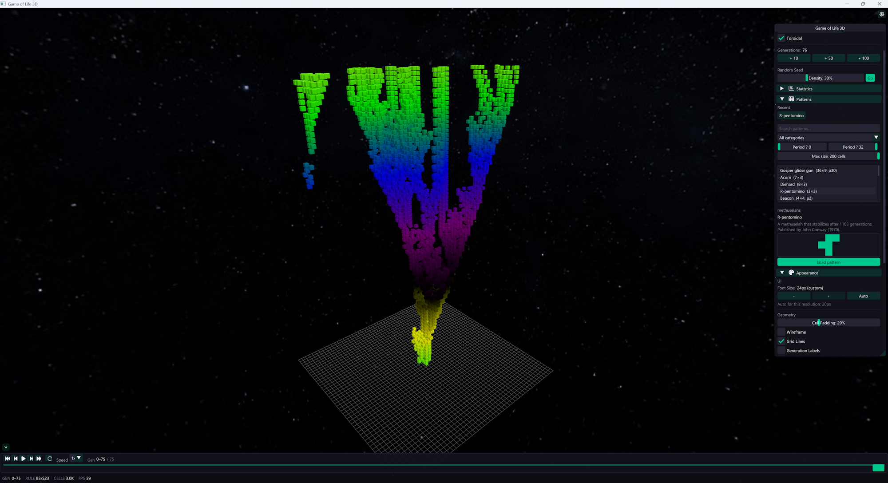

# GameOfLife3D.NET

A 3D visualization of Conway's Game of Life built with .NET 10, Silk.NET, and OpenGL 3.3. Each alive cell is rendered as a cube in 3D space, with generations stacking along the Y axis to create a sculptural time history of the simulation.



## Features

- **3D generation stacking** — 2D Game of Life computed across generations, rendered as cubes (X=column, Y=generation, Z=row)
- **Instanced rendering** — OpenGL instanced draw calls handle up to 4 million cubes efficiently
- **Color cycling gradient** — HSL-based color animation across generations with configurable hue angles
- **Wireframe overlay** — togglable edge rendering with independent color cycling
- **ImGui control panel** — pattern selection, rule editing (9 presets + custom B/S rules), grid size, toroidal wrapping
- **Timeline transport** — play/pause, speed control, and generation range scrubbing
- **Video recording** — capture the current view as H.264 MP4 or VP9 WebM using ffmpeg
- **Session persistence** — save/load full state (pattern, camera, colors, display range) as JSON
- **RLE import** — load patterns from standard .rle files
- **Built-in patterns** — R-pentomino, Glider, Blinker, Pulsar, Gosper Glider Gun

## Controls

| Input | Action |
|-------|--------|
| Left mouse drag | Orbit camera |
| Right mouse drag | Pan camera |
| Scroll wheel | Zoom |
| WASD | Move camera |
| Q / E | Rotate camera |
| R / F | Camera up / down |
| 0 | Restart auto orbit |
| Space | Play / Pause |
| Ctrl+R | Record video |

## Recording Video

Video recording requires [ffmpeg](https://ffmpeg.org/download.html) to be installed before the app starts. GameOfLife3D.NET does not bundle ffmpeg; it detects an `ffmpeg` executable from your PATH, or from common install locations on macOS and Linux.

Install ffmpeg with one of the following:

```bash
# Windows
winget install ffmpeg

# macOS
brew install ffmpeg

# Ubuntu / Debian
sudo apt install ffmpeg

# Fedora
sudo dnf install ffmpeg
```

After installing ffmpeg, restart GameOfLife3D.NET so video recording is enabled.

To record, open the control panel, choose a duration and codec in the **Record Video** section, then press **Ctrl+R**. Recording captures the current rendered scene at the current window resolution and saves at 30 FPS; the ImGui controls and recording indicator are not included in the video. When recording completes, choose where to save the generated `.mp4` or `.webm` file.

The default **H.264 MP4** option requires an ffmpeg build with `libx264` support. If your ffmpeg build does not include `libx264`, switch the codec to **VP9 WebM** or install an ffmpeg build that includes H.264 encoding support.

## Build from Source

Requires [.NET 10 SDK](https://dotnet.microsoft.com/download). Recording video also requires ffmpeg, as described above.

```bash
dotnet build                                    # Debug build
dotnet run --project src/GameOfLife3D.NET/      # Run
dotnet publish src/GameOfLife3D.NET/ -c Release  # Publish self-contained exe
```

The RuntimeIdentifier is auto-detected (`win-x64` on Windows, `linux-x64` on Linux).

## License

See repository root for license information.
